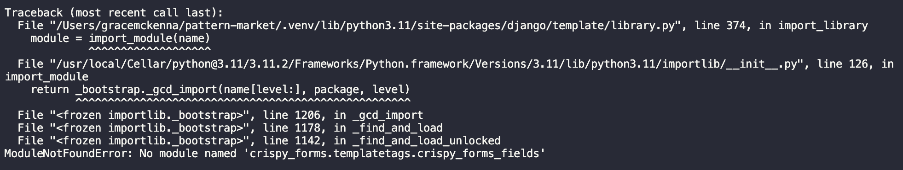
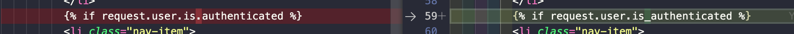
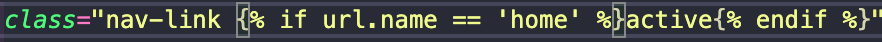
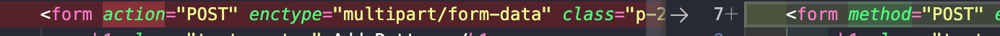

 

# Table of Contents

- [Table of Contents](#table-of-contents)
- [Site Overview](#site-overview)
  - [Goal](#goal)
  - [Technologies \& Resources used](#technologies--resources-used)
- [UX](#ux)
  - [Target Audience](#target-audience)
  - [Wireframes](#wireframes)
- [Features](#features)
  - [Existing Features](#existing-features)
  - [Future Features](#future-features)
- [Design](#design)
- [Testing](#testing)
  - [Bugs](#bugs)
  - [Known Issues](#known-issues)
- [Deployment](#deployment)
  - [Deployment to Heroku](#deployment-to-heroku)
  - [How to Fork](#how-to-fork)
- [Credits](#credits)
  - [Code](#code)
  - [Images](#images)
    - [Version Control](#version-control)
- [Acknowledgments](#acknowledgments)
  

# Site Overview
Deployed Site: 

## Goal

## Technologies & Resources used

- [Python](https://www.python.org/) 
- [GitHub](https://github.com/)
- [Visual Studio Code](https://code.visualstudio.com/) 
- [UXWing](https://uxwing.com/)
- [django-allauth](https://django-allauth.readthedocs.io/en/latest/installation.html)
- [Crispy forms](https://django-crispy-forms.readthedocs.io/en/latest/install.html)
- [Crispy Bootstrap5](https://github.com/django-crispy-forms/crispy-bootstrap5)
- [Pillow](https://pypi.org/project/Pillow/)
- [RichTextField](https://pypi.org/project/django-richtextfield/)
- [django-resized](https://pypi.org/project/django-resized/)
- [CSS Gradient](https://cssgradient.io/)
- [black formatter](https://black.readthedocs.io/en/stable/)
- [Online Convert](https://www.online-convert.com/)

# UX
## Target Audience

## Wireframes

           
Initial Project Wireframes

           

           
Base Website

          

          

          

          
Profile Pages

        

         
 

# Features

## Existing Features

## Future Features

# Design

# Testing

## Bugs

Bug | Status | Fix | Images of bug
----|--------|-----|--------------
Server would not run| Fixed | Typo in settings.py (extra 's') |
AllAuth templates would not load | Fixed | Typo in authentication statement in header.html (used '.' rather than '_') | 
Active class CSS would not load | Fixed | typo ('.' rather than '_' used) | 
When trying to add pattern, receives error | Fixed | Used form action instead of form method|  
## Known Issues

# Deployment 
## Deployment to Heroku
1. Go to [Heroku](https://dashboard.heroku.com/apps)
2. Go to 'New' and select 'Create a new app'
3. Input your app name and create app.
4. Navigate to 'Settings'
5. Install the needed buildpacks. Select Python and install and then node.js and install and then click save. They must be in this order.
6. Navigate to the 'Deploy' section. 
7. Connect to GitHub, search for your repo and confirm. 
8. Choose branch to deploy.
9. Your app should now be available to see. You can choose whether to have your app automatically redeploy with every push or to keep it manual. 

## How to Fork
1. Login/signup to [GitHub](https://github.com/).
2. Locate the relevant repository - in this case [gracemcken/pattern-market](https://github.com/gracemcken/pattern-market)
3. Click on the 'Fork' button in the upper left.
4. Your forked version of this repo will be generated!
# Credits
## Code
Inspired by [Daisy's](https://github.com/Daisy-McG) wonderful Django [project walkthrough](https://github.com/Daisy-McG/Recipe-Tutorial). Methods of building the website were learned from this walkthrough, however was customised for my own project.

## Images
All images except the hero image were created by me. Hero image can be found [here](https://www.pexels.com/photo/close-up-photo-of-blue-thread-3330009/) on .

### Version Control

# Acknowledgments