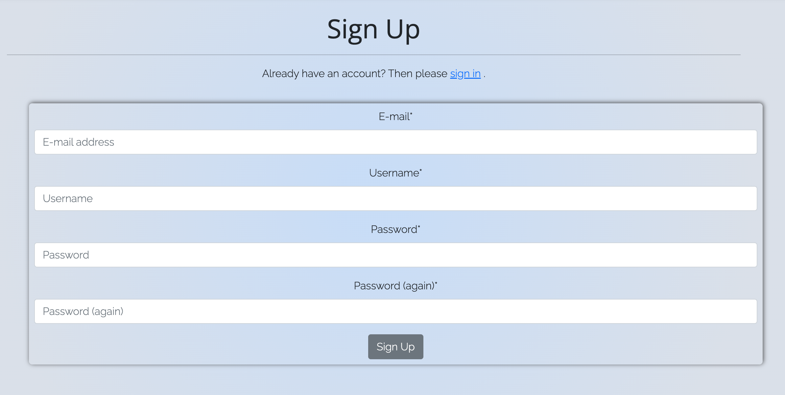
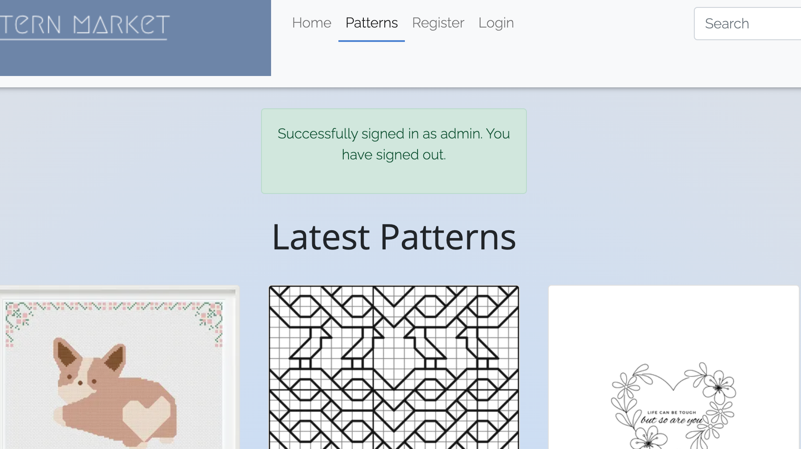

 

# Table of Contents

- [Table of Contents](#table-of-contents)
- [Site Overview](#site-overview)
  - [Goal](#goal)
  - [Technologies \& Resources used](#technologies--resources-used)
- [UX](#ux)
  - [Wireframes](#wireframes)
  - [User Stories](#user-stories)
- [Features](#features)
  - [Existing Features](#existing-features)
    - [Nav bar](#nav-bar)
    - [Hero Banner](#hero-banner)
    - [Footer](#footer)
    - [Sign Up \& Login Forms](#sign-up--login-forms)
    - [Logout Confirmation](#logout-confirmation)
    - [Recent Patterns](#recent-patterns)
    - [Pattern View](#pattern-view)
    - [Add Pattern](#add-pattern)
  - [Future Features](#future-features)
- [Design](#design)
- [Testing](#testing)
  - [Bugs](#bugs)
  - [Known Issues](#known-issues)
- [Deployment](#deployment)
  - [Deployment to Heroku](#deployment-to-heroku)
  - [How to Fork](#how-to-fork)
- [Credits](#credits)
  - [Code](#code)
  - [Images](#images)
- [Acknowledgments](#acknowledgments)
  

# Site Overview
Deployed Site: [Link](https://pattern-market.herokuapp.com/)

## Goal

This website was not my initial plan for my project 4, however due to sudden and prolonged illness, I had to complete this project in a short amount of time and my first version of P4 was too large of a scope to achieve. Faced with time constraints, I decided to focus on achieving the MVP required and build a basic website with CRUD functionality where users can upload their different needlework patterns.

Most of this project was based on a recipe website tutorial (credited below in the relevant section), and was customised to suit my idea of posting and editing patterns rather than recipes. This project began as something to just tick boxes, however I fully believe it is an idea that has the potential to be developed much more.

## Technologies & Resources used

- [Python](https://www.python.org/) 
- [GitHub](https://github.com/)
- [Visual Studio Code](https://code.visualstudio.com/) 
- [UXWing](https://uxwing.com/)
- [django-allauth](https://django-allauth.readthedocs.io/en/latest/installation.html)
- [Crispy forms](https://django-crispy-forms.readthedocs.io/en/latest/install.html)
- [Crispy Bootstrap5](https://github.com/django-crispy-forms/crispy-bootstrap5)
- [Pillow](https://pypi.org/project/Pillow/)
- [RichTextField](https://pypi.org/project/django-richtextfield/)
- [django-resized](https://pypi.org/project/django-resized/)
- [CSS Gradient](https://cssgradient.io/)
- [black formatter](https://black.readthedocs.io/en/stable/)
- [Online Convert](https://www.online-convert.com/)
- [django messages](https://docs.djangoproject.com/en/4.2/ref/contrib/messages/)
# UX

## Wireframes

           
Pages when signed out

 

          

          

          

          
When signed in

        

        
         
 

## User Stories

User stories and agile development can be found on the project board [here](https://github.com/users/gracemcken/projects/4)

# Features

## Existing Features

### Nav bar

This website has two versions of a navbar depending on whether a user is signed in or not. If a user is not authenticated, this is the version that will be shown:

Available to view is the home page, the pattern page, the register page and the login page. Only when a user is signed in and authenticated can they access this next version of the navbar, which includes the ability to upload patterns and log out:

Each navbar also highlights which page the user is currently on.

### Hero Banner

The website also features two different versions of the hero banner on the home page. If a user is not logged in, this version will be displayed, prompting the user to either sign up or view the patterns available:

If a user is signed in, the hero image appears different, prompting the user to start uploading patterns or providing access to already uploaded patterns.

### Footer

The footer is basic and simple, containing icons and links to social networks.

### Sign Up & Login Forms

Using the django allauth templates, the website includes both a sign up page and a login page.

### Logout Confirmation

If a signed in user attempts to logout, they will be prompted to confirm it with this logout page.

### Recent Patterns

When a user navigates to the Patterns page, they will find a gallery of clickable cards that lead to different patterns that have been uploaded.

### Pattern View

Should a user click into a pattern, they will have either two views. If they are logged in and were the user who uploaded the pattern, they will have the options to edit or delete.

However if a user is either not logged in or is logged in but not the original poster, they will see the pattern without those options.

### Add Pattern

If a user is logged in, they will be able to add a pattern. This page contains several fields and the ability to upload an image.

## Future Features

This website has been set up to use a search functionality, however due to lack of time this was not implemented. I would also like to enable the ability to upload files that can then be downloaded, as many patterns are created in a PDF format by designers. I don't think this would be too difficult to implement, however I did not have time. The ability to comment and like patterns is something I think would work well on this website as well.

# Design

When designing this website I wanted to keep the colours mild and neutral so that the patterns posted would stand out. Along with a muted colour scheme, I also used simple fonts so not to detract from the posts.

# Testing

## Bugs

Bug | Status | Fix | Images of bug
----|--------|-----|--------------
Server would not run| Fixed | Typo in settings.py (extra 's') |
AllAuth templates would not load | Fixed | Typo in authentication statement in header.html (used '.' rather than '_') | 
Active class CSS would not load | Fixed | typo ('.' rather than '_' used) | 
When trying to add pattern, receives error | Fixed | Used form action instead of form method|  
## Known Issues

1. Sometimes when loading the patterns page, the user will receive a delayed message about their activity with logging in and logging out. Due to time constraints, I did not have the opportunity to debug this and figure out why it only happens occasionally. Attached is an image of what I mean. 
2. Search bar is non-functional. This has now a future feature which would be easily implemented if I had more time.

# Deployment 
## Deployment to Heroku
1. Go to [Heroku](https://dashboard.heroku.com/apps)
2. Go to 'New' and select 'Create a new app'
3. Input your app name and create app.
4. Navigate to 'Settings'
5. Install the needed buildpacks. Select Python and install and then node.js and install and then click save. They must be in this order.
6. Navigate to the 'Deploy' section. 
7. Connect to GitHub, search for your repo and confirm. 
8. Choose branch to deploy.
9. Your app should now be available to see. You can choose whether to have your app automatically redeploy with every push or to keep it manual. 

## How to Fork
1. Login/signup to [GitHub](https://github.com/).
2. Locate the relevant repository - in this case [gracemcken/pattern-market](https://github.com/gracemcken/pattern-market)
3. Click on the 'Fork' button in the upper left.
4. Your forked version of this repo will be generated!
# Credits
## Code
Inspired by [Daisy's](https://github.com/Daisy-McG) wonderful Django [project walkthrough](https://github.com/Daisy-McG/Recipe-Tutorial). Methods of building the website were learned from this walkthrough, however was customised for my own project.

## Images
All images except the hero image were created by me. Hero image can be found [here](https://www.pexels.com/photo/close-up-photo-of-blue-thread-3330009/) on .

# Acknowledgments